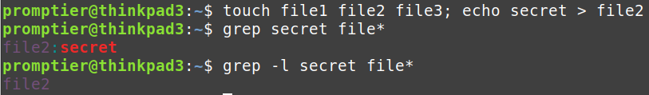
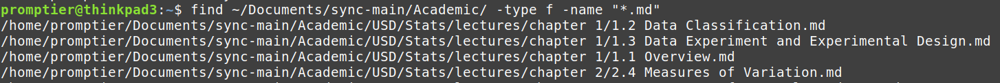
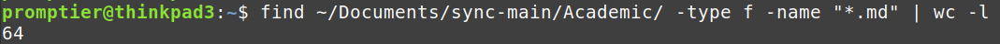

Back ticks in bash are for command substitution, which is when you want to capture the output of a command, and store it in a variable.

For example, running the `date` command in any Linux terminal will output the date in a long format.
```
date
Wed Sep 13 06:41:48 AM CDT 2023
```

However, if we create a file `backticks.sh` and wanted to store that output in a special format inside our own variable, we can do that within back ticks.
```bash
#!/bin/bash
my_date=`date +%m-%d-%Y`
echo "You accessed this date on $my_date"
```
Output
```
You accessed this date on 09-13-2023
```

Now let's get a little more advanced. First lets create three files, then write the text "secret" to the second file. We can search each file with `grep [options] [file]` and use the wildcard/star `*` to find all 3 files. We can see the output of `l` omits the regular output and just prints the file which contains the text, that's what we want.
```
touch file1 file2 file3; echo secret > file2
grep -l secret file*
```



Let's write a script that uses the output of the second grep to automatically open our text editor with the file that contains the secret. Using any text editor,  wrap that command in the back tick.

```bash
#!/bin/bash
vim `grep -l secret file*`
```

Now running the script with `bash backticks.sh` is equivalent to `vim file2` or opening whichever file has the secret. 

For a third example, I want to count how many markdown files are in my Obsidian vault, which contains all of my notes. Before we capture any new command in back ticks, let's first understand what we'll be using. `find` is a very useful tool in Linux an does just what it says, goes and finds files and directories. It has loads of options and it's man page is over 1,000 lines long, but we'll just stick with `-type f` to specify we are looking for files and `name "*.md"` to only return markdown files.

If you would like to follow along, you can either find your own directory with all of the same file endings, or just `touch` a bunch of text files and replace the target directory and `name` with `".txt"`.

After running the `find` command with the correct`type` and `file` options, I get very verbose output. 



Next, since I know each instance of a markdown file is separated by a newline which I can use word count `wc` with the `-l` option to print the number of newline counts.



OK, we finally have what we want, now let's put this in a bash script. First, what we had before was recursive by default, meaning it continuously searched directories withing directories, but we can give the user the option by setting the `-maxdepth` to 1. This entire command is then wrapped in back ticks to be stored in the `count` variable.

```bash
read -p "Recursive? y/n > " option 
read -p "Enter directory path > " directory  
if [ "$option" == "y" ]; then     
	count=`find "$directory" -type f -name "*.md" | wc -l` 
elif [ "$option" == "n" ]; then     
	count=`find "$directory" -maxdepth 1 -type f -name "*.md" | wc -l` 
else     
	echo "Invalid option." 
	fi  
echo "Count of .md files: $count"``
```
