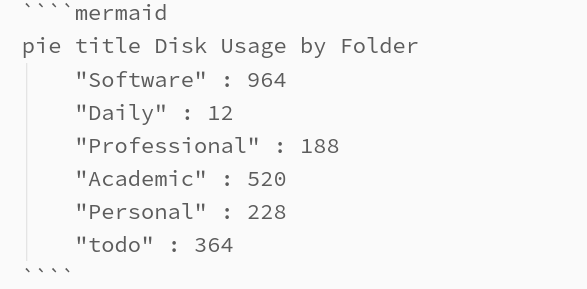
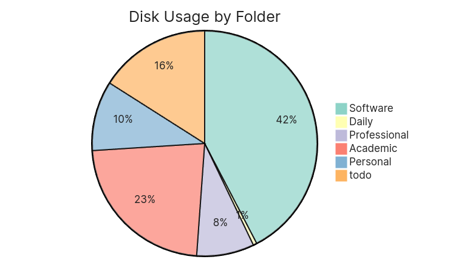
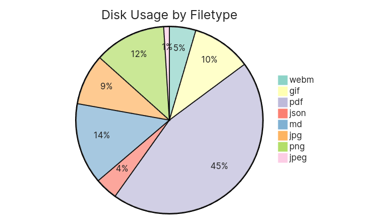
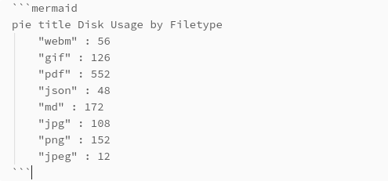

### Overview 

In this article you will find several bash scripts that I will walk through. These scripts were part of a real project and hopefully you will learn more with a real life example than a simple tutorial, but first we need context. 

Obsidian is a markdown based note taking app with a large ecosystem of over 1,000 3rd party extensions written by open source developers. Having my own idea of tracking disk usage by folders, filetypes and plugins, I decided to create my own. On Linux, I had Bash ready at my command to easily write these scripts, since Obsidian is all markdown based, all I would need to do is write all of this data to a `.md` file, such as the following:



This would then render a chart using Mermaid inside of Obsidian.



### Disk Usage by Folder

To start the bash script, we must first learn about the `du` (disk usage) command. `du` followed by a directory will output the directory and size in bytes. I only want to display the first level of directories, so I will use the depth `-d` flag telling it to only go 1 level deep.

```
# du -d 1 sync-main/

552	    sync-main/Academic
968	    sync-main/Notes
5672	sync-main/.obsidian
232	    sync-main/Personal
72	    sync-main/Military
12	    sync-main/Daily
188	    sync-main/Professional
364	    sync-main/todo
8072	sync-main/
```

Although you can use the human readable `-h` flag to read kilobytes or megabytes, we will need the raw bytes as a universal measure which will calculate the percents on the chart you see above.

The problem is, the output will look a bit different. You see, this script sits in a plugin folder which is exactly 3 layers below where we need to measure `du` from, which is the root of the Obsidian vault.

`[ROOT-OF-VAULT]/.obsidian/plugins/disk-usage/script.sh`

This measures from the root of the vault.
```
# du -d 1 ../../../

552	    ../../../Academic
968	    ../../../Notes
5672	../../../.obsidian
232	    ../../../Personal
72	    ../../../Military
12	    ../../../Daily
188	    ../../../Professional
364	    ../../../todo
8072	../../../
```

Now let's pipe that output into `sed` (Stream EDitor) and clear up the slashes first. 
```
# du -d 1 ../../../ | sed 's|[/]||g'

552	    ......Academic
968	    ......Notes
5672	.......obsidian
232	    ......Personal
72	    ......Military
12	    ......Daily
188	    ......Professional
364	    ......todo
8072	......
```

Next let's remove the dots.
```
# du -d 1 ../../../ | sed 's|[/]||g' | sed 's/\.\{2,\}//g'

552	    Academic
968	    Notes
5672	obsidian
232	    Personal
72	    Military
12	    Daily
188	    Professional
364	    todo
8072	
```

I don't care to include the `.obsidian` hidden folder, so I will remove it with `grep -v`.  Also I don't need the total at the bottom so I can remove it wil `head -n -1`. These commands are also getting long so I will create a script for it. I'll give excecutable permission with `chmod` and excecute.
```bash
#!/bin/bash
du -d 1 ../../../ | sed 's|[/]||g' | sed 's/\.\{2,\}//g' | grep -v 'obsidian' | head -n -1
```

```
# chmod +x script.sh
# bash script.sh

552	Academic
968	Notes
232	Personal
72	Military
12	Daily
188	Professional
364	todo

```

Now we can `read` each line into an associative array. This is just key value pairs, similar to a dictionary in Python. The `while read` will read the input line by line storing each value in `numbers` and `name` respectivily, storing the name as key and numbers as values. The input source for the while loop is generated from `< <` followed by the commands from earlier.

```bash
declare -A myArray
while read number name; do
  myArray["$name"]=$number
done < <(du -d 1 ../../../ | sed 's|[/]||g' | sed 's/\.\{2,\}//g' | grep -v 'obsidian' | head -n -1)
```

Now remember the chart from before? Let's begin by writing to a file with `>` and then appending with `>>`. We then loop through the keys and values of the associative array, appending the folders and their respective size. 

```bash
echo '```mermaid' > folders.md
echo 'pie title Disk Usage by Folder' >> folders.md

# Add pie chart data to Markdown file
for key in "${!myArray[@]}"; do
  echo "    \"$key\" : ${myArray[$key]}" >> folders.md
done

# Close mermaid code block
echo '```' >> folders.md
```

Now we should have the same pie chart from before! 

### Disk Usage by File type

Now what if we wanted to find data by file types? For example, my vault could be slow while loading, and this could be due to limited space, so I then want to find the culprit. Could it be images, pdfs? A chart like this would help.



What we want to do is `find` all files of a specific type and then pipe that into `du` with the total `-c` flag. By default, the find command seperates the output with newlines, the du command will only work if they are null terminated (\0) with `-print0`. The next odd looking flag, `--files0-from=-` basically says read a list of null-terminated file paths from standard input. `-` is stdin, `F` would reading from a file.

```
# find ../../../ -name '*.md' -print0 | du -c --files0-from=-

#[ommitted files for brevity]
4	../../../todo/Calendar/Drill/2023-09-09 Muta 6.md
4	../../../todo/Calendar/CSC155L/(Every R) CSC155L.md
4	../../../todo/Calendar/MUS100/2023-10-22 asdf.md
4	../../../todo/Calendar/MUS100/2023-10-03 Music Midterm.md
4	../../../todo/Calendar/MUS100/(Every R,T) MUS100.md
4	../../../todo/Calendar/CSC155/(Every R,T) CSC155.md
4	../../../todo/Calendar/THC Cutoff/2023-07-27 Go clean.md
4	../../../todo/st.md
4	../../../todo/scratch.md
1800	total
```

We will get a very verbose output. The very last line is all we will need. `tail -1` will print just the last line and `awk '{print $1}'` will just print the first field of the line, which is 1800.

```
#find ../../../ -name "*.md" -print0 | du -c --files0-from=- | tail -1 | awk '{print $1}'

1800
```

So now we have some commands strung together that can find the disk usage that any particular file type is taking up in a given directory. Let's now create a function with a local variable `file_type` which will be the first parameter. Then `disk_usage` will use command substitution to wrap the previous commands inside the variable. We can then call the function with the file types as arguments. 

```bash
get_size() {
  local file_type="$1"
  local disk_usage=$(find ../../../ -iname "*.$file_type" -print0 | du -c --   files0-from=- | tail -1 | awk '{print $1}')
  echo "    \"$file_type\" : $disk_usage"
  }

get_size png
get_size md
get_size pdf
```
Output
```
"png" : 68
"md" : 1800
"pdf" : 0
```

Next, to generate the chart, we will create an array with every file extension we want, then loop through it while appending to the `.md` file which will contain the chart.

```bash
file_types=("webm" "gif" "pdf" "json" "md" "jpg" "png" "jpeg" "excalidraw")

echo '```mermaid' > filetypes.md
echo 'pie title Disk Usage by Filetype' >> filetypes.md

for file_type in ${file_types[@]}; do
  get_size $file_type >> filetypes.md
done

echo '```' >> filetypes.md
```

The chart should look something like this which can be rendered inside Obsidian, and other markdown editors that support Mermaid.



### Full Bash Code and Rewritten in Javascript for Obsidian

After I wrote all this I realized since it required sudo (elevated priviledge) and only would run on Linux, it would be a poor implementation. Instead writing it in Javascript would make it cross-platform as the code would excecute within the Electron cross-platform instance, whether on MacOS, or Android.

Since over a year ago since publishing this plugin, it has 2,400 downloads as of writing this and can be seen on the Obsidian Website [here](https://obsidian.md/plugins?search=disk%20usage). 

Here are links to the [Bash implementation](https://github.com/Promptier/Bash-Scripts) and the Disk Usage plugin [repository](https://github.com/Promptier/disk-usage) (Javascript implementation).
