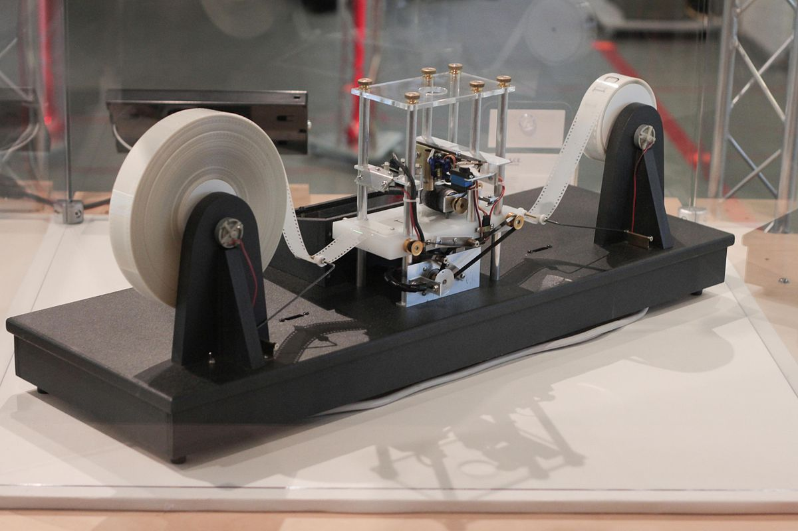
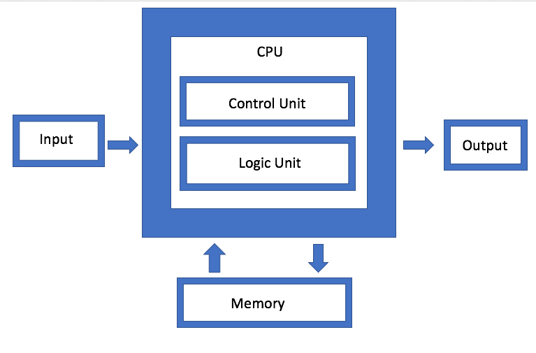

In this timeline, I plan to analyze the history software and computers. Starting with the earliest mainframes, such as the ENIAC in 1945, designed to calculate artillery fire in WW2, and transitioning to UNIX development in the late 60s and early 70s. Next diving into GNU/Linux and the development of free and open source software in the 80s and 90s, all the way to newer technology, such as modern web development and javascript frameworks.

Note: I will be placing all timeline related notes here for now not just what's mentioned above.

##### Alan Turing 1937

Dealing with the philosophical problem of defining "computing" itself, Alan Turing came up with the theoretical machine that could solve any calculation, given enough time. In the 30's, computers were either analog/mechanical or built using tapes such as Turing's device below. This idea of a universal computational device is key to understanding Computer Science as a field of study and what distinguishes it from all others.

A mechanical engineer does not study the engine, but rather physics. A chemical engineer does not study the factory, but chemistry itself. So then what does a computer scientist study? You might guess physics or electrical engineering, but they study the computer itself, that is because a computer, or rather, a universal computational device, is fundamentally different than an engine or a factory. A computer large enough could run the engine and the factory within a program a thousand times over, and any possible algorithm imaginable. Because we stand on the shoulders of giants, we understand computers as Turing complete which distinguishes Computer Science from all other fields.

##### The Von Neumann Model

In progress

##### ENIAC 1946

The first digital computer was the [[eniac.webp|ENIAC]], which stood for Electronic Numerical Integrator and Computer. This project was originally intended for solving differential equations and other other academic pursuits by physicists and mathematicians, but the real funding and attention began when the US military saw it's potential for calculating artillery fire. 

Despite this, it was finished only after WW2 was ended. The ENIAC was completed in 1946, and never saw much fruition in wartime. Intended for death and destruction, it was instead used for weather prediction, cosmic-ray studies and other scientific pursuits. The ENIAC essentially became a foundational tool in the evolution of computer science.

##### UNIVAC

The successor the ENIAC, the UNIVAC (Universal Automatic Computer) was the first business application computer.

##### Fortran 1954

Arguably the first "high level" programming language, FORTRAN (FORmula TRANslator) was developed by IBM for science and engineering.  

##### COBOL 1959

COBOL (Common Business-Oriented Language) was developed by American Computer Scientist Grace Murray Hopper and served as a solution to businesses to use a single language for facilitating transactions.

##### TRADIC 1955

TRADIC stood for TRAnsistor DIgital Computer. It was the first of it's kind to be build using only transistors and diodes instead of vacuum tubes. It was built by Bell Labs for the US Military.

##### MULTICS 1964

Multics (Multiplexed Information and Computing Service) was a highly ambitious project funded by MIT, General Electric, and AT&T's research group, Bell Labs. Ken Thompson and Dennis Ritchie were key figures and are later discussed for their major contributions to the world of software. 

In the early 60's, time sharing (multiple users sharing the same resources) and file systems were a novelty. However, the project was over-budget, overdue and over engineered.

The developers were frustrated with it's complexity, Ken Thompson was unable to play his [Space Travel](https://en.wikipedia.org/wiki/Space_Travel_(video_game)) game as it was costly and inefficient on the Multics. So he essentially started from scratch on a PDP-7, writing what would eventually become Unix.

Ken Thompson (sitting) and Dennis Ritchie (standing) on a PDP-11

##### UNIX 1969

Unix was born out of a failure of Multics. While Ken Thompson was rewriting everything from scratch on his PDP-7, it essentially became a lighter weight, stripped away version of Multics. When presenting it to his colleagues, they joked it was a "Eunuch Multics" as if it had been castrated, thus the name Unix was born.

There is no doubt the frustration of complexity with Multics and the practice of simplifying and stripping away was key to the  [Unix Philosophy](http://www.catb.org/~esr/writings/taoup/html/ch01s06.html), a design/programming style which emphasizes simplicity, modularity and to "do one thing and do it well".

##### Relational Database 1970

In the early 1960's, hierarchical and network databases were based off graphs and trees. E.F Codd, while working at IBM, proposed a new relational model made of tables (relations). This approach made it much easier to manipulate data, by modifying columns and rows.

His work paved the way for SQL (Structured Query Language) and modern relational databases like MySQL, PostgreSQL, and SQL Server, which are descendants of these early efforts and to utilize SQL for data manipulation and querying.

This [article](https://learnsql.com/blog/codd-article-databases/) goes more in depth.

One of the first companies to monetize relational databases was Relational Software Inc. (1979–82), later renamed to Oracle in 1982. In 1987, Oracle was named the largest database management company. In recent years, Oracle has partnered with Microsoft in the cloud space to challenge AWS. Here is a complete [timeline](https://www.oracle.com/corporate/).

##### C 1972

Before 1972, Unix was written entirely in assembly. The use of assembly made Unix hard to port across different hardware. Dennis Ritchie, who worked with Ken Thompson at Bell Labs, developed C in the early 1970s. The development of C was revolutionary because it combined the efficiency of assembly language with the ease of a human readable, high level language.

Once C was created, Ken Thompson and others rewrote Unix in C, making it one of the first operating systems to be written in a high-level language. This made Unix highly portable, a characteristic that contributed to its widespread adoption. The co-development of Unix and C at Bell Labs is a monumental moment in computer science, influencing operating systems and programming languages even today.

##### GNU 1983

AT&T was essentially a regulated monopoly in the 60s and 70s. They were restricted only to telecommunications at the time and were not allowed to sell computers. Their research institute, Bell Labs had just created Unix, so they sold licenses to schools and used it as an educational tool instead. The source code was accessible to students across universities with restrictions. One of these student's was Richard Stallman, who worked at MIT's Artificial Intelligence Laboratory.

In the 1980's, almost all software was closed source and proprietary. Richard Stallman created the GNU (GNU Not Unix) Project in 1983 to develop a free and open source software replacement for Unix. This included replacing every program.

Common GNU programs include `ls`, `cp`, `cat` and many [others](https://en.wikipedia.org/wiki/List_of_GNU_Core_Utilities_commands), If these look like "Linux" commands, they are not. What we know as Linux today is in fact mostly made of GNU programs. Linux is the kernel. Combined, they are GNU/Linux.
##### Linux 1991

The GNU operating system was nearly complete, but missing a key part, the kernel - the central component that manages resources and acts as an intermediary between software and hardware. GNU was working on a kernel called Hurd, but it was taking longer than expected to become functional. 

Around this time, a Finnish Computer Science student, Linus Torvalds, started working on a hobby operating system, outlined in his famous . After 3 years of work, Version 1.0 was released in 1994 and was clear it would serve as the missing piece to GNU.

##### Debian 1993

American software engineer, Ian Murdock, created Debian, the first Linux distribution along with the Debian Project, which aimed to create a free and open source operating system based on GNU/Linux. The name "Debian" is a portmanteau of Ian and his wife's name Debora. 

Today, most Linux Distros such as Ubuntu and Linux Mint are Debian based, and the majority of web servers today are Debian or Debian based.  Common Debian utilities include `apt` (advanced packaging tool) and `dpkg` (debian package).  

##### Red Hat 1993

Red Hat was founded on two main pillars, develop a Linux distribution and provide related support services. Red Hat Enterprise Linux (REHL) served as it's flagship product along with subscription-based services that included technical support, software updates, and security patches.

Targeted at businesses that needed a reliable OS for enterprise applications and infrastructure, they quickly became a success. in 2012, they became the first Open Source Company to exceed $1 Billion in revenue. After growing for a number of years, they were later [acquired](https://www.redhat.com/en/about/press-releases/ibm-closes-landmark-acquisition-red-hat-34-billion-defines-open-hybrid-cloud-future) by IBM for $34 Billion in 2019.

Although their business model still revolves around open-source software and subscriptions for support and services, their scope has expanded significantly, now providing cloud services and tools like [Ansible](https://www.youtube.com/watch?v=xRMPKQweySE) for automating IT infrastructure. 

Despite claiming a commitment to open source, Red Hat is now under [criticism](https://www.youtube.com/watch?v=kF5pyVUQBH8&t=34s) for pay-walling the source code to RHEL. 

##### REST & Web Standardization 2000

In 2000, Roy Fielding introduced the concept of REST (Representational State Transfer) in his doctoral [dissertation](https://www.ics.uci.edu/~fielding/pubs/dissertation/rest_arch_style.htm) as a framework for web standardization. REST laid the groundwork for building scalable, stateless web services and has become a foundational in modern web development and API design.

##### Namespaces 2002

Linux kernel feature which allows a set of processes to only see a certain number of resources. This is a foundational technology which underlies container runtimes like Docker.

##### AWS 2002

I don't know if I'll even do this one.

##### Canonicol & Ubuntu 2004 

Canonical Ltd. was founded by Mark Shuttleworth, a multi-millionaire and vocal [advocate](https://youtu.be/GvaWH-twx0o?t=151) of open source software. Ubuntu's first version, 4.10 (named after the year and month) was released in October of 2004 as a free and open source, Debian based distribution. The business model is similar to Red Hat: which aims to monetize open source software by providing services and support.

##### Amazon S3 and EC2 2006

Amazon's Elastic Cloud Compute (EC2) popularized the use of the term *cloud* by which offered customers a cluster of virtual machines communicating over the web via Rest API to relieve the burden of managing operating systems and hardware on-premise. 

##### Cgroups 2007

The foundational (C)ontainer group technology is developed at Google. This limits CPU and other resource usage to running tasks which underlie all container technology today. 

##### Openshift 2011

Red Hat released Openshift as a cloud platform and the first container major container orchestrater. Though it is important to note key technology was developed at Google such as LXC and Cgroups in 2007-2008 which is used by nearly all container runtimes.

##### Docker 2013

Frustrated with managing different languages, libraries, and runtimes Solomon Hykes developed his own solution using cgroups to isolate resource usage. This eventually lead to what we know know as Docker. As the company Docker Inc. (previously Dotcloud) grew they wanted to differentiate their commercial product with an upstream open source project. They renamed Docker on Github to Moby in 2017.  

##### Kubernetes 2015

With the emerging AWS as the giant in tech, Google realized the Cloud was inevitable. Inspired by Docker, and originally using Docker for a runtime (now CRI-O), the now most popular container orchestrater was built. Kubernetes emerged as the victor of the Container Orchestration War.

