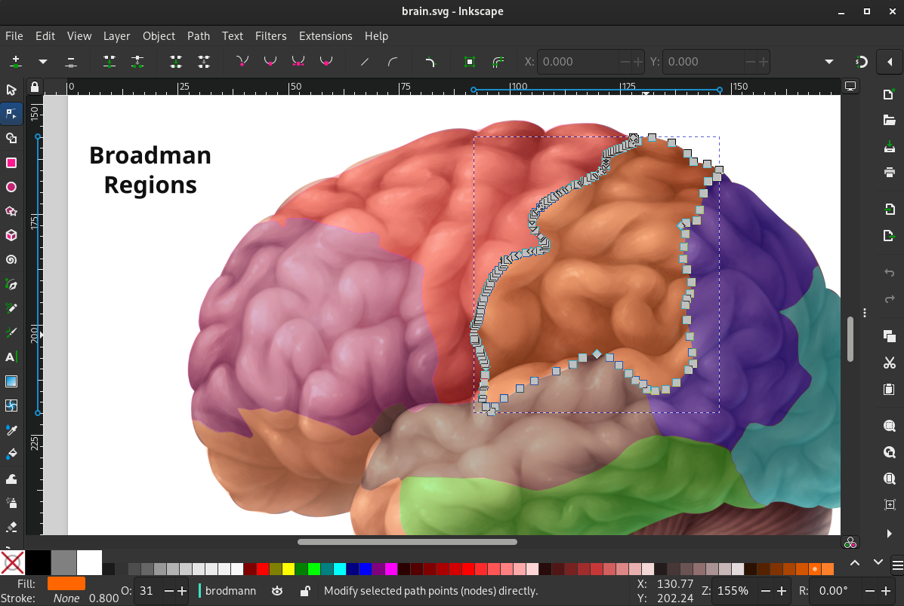
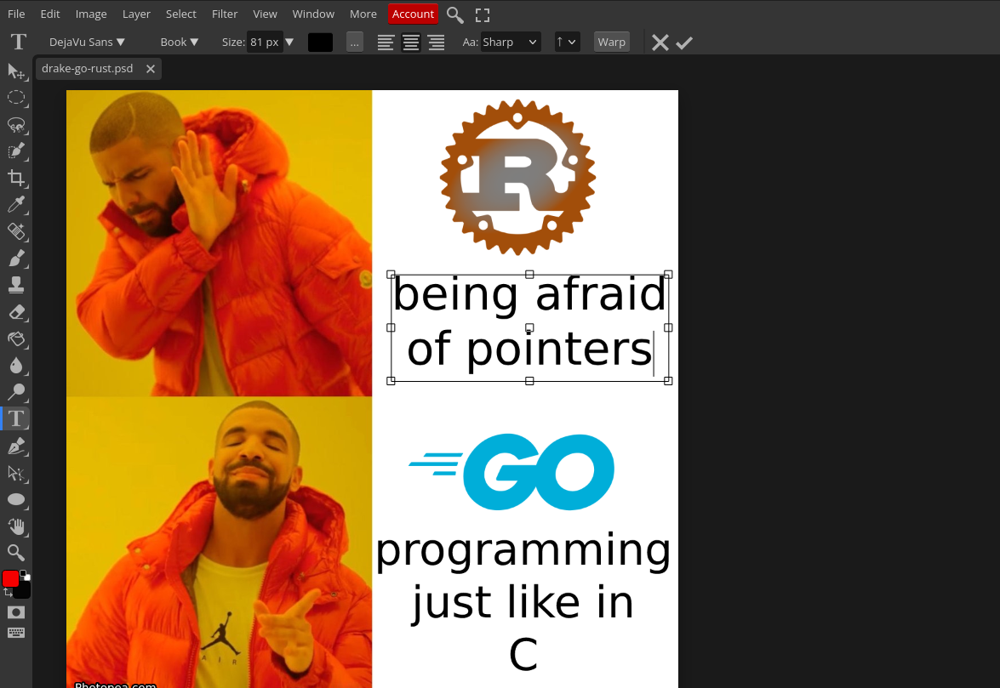
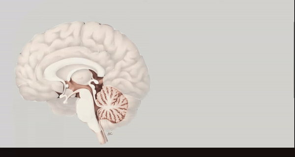
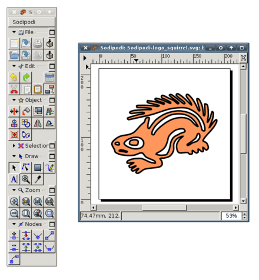
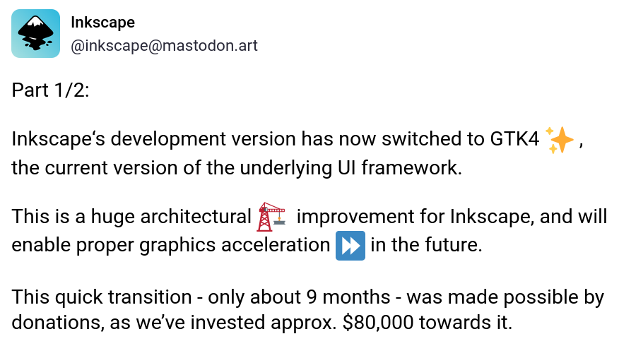

> 📝️ **Video Transcript**: This is the transcript for a video on my youtube channel. It should still be just as readable as an article, but you can also find the video [here](https://www.youtube.com/watch?v=2kbvGGOj3ps).

### Inkscape

I've used many image editing software and there's one in particular that stands out the most. Inkscape has grown on me more than anything else because it's easy to use, yet also has a large number of features where you're always learning something new and constantly improving your workflow. I have used Gimp in the past, but eventually gave up with how difficult it was to learn, not to mention how dated the interface felt. Inkscape seems to have more frequent updates and support and overall better outlook for the future. People often compare Inkscape to Adobe illustrator as they are both SVG based image editors. I have no comment on this as I am proud to say I have never paid for an Adobe product and do not support the company, so I unfortunately cannot give a good comparison.

Here is my brain anatomy map in Inkscape I plan on making interactable in a webpage by clicking a region and a side bar appears with information. Also very useful for taking notes for Neurobiology.

### Photopea

The next image editor worth mentioning is Photopea, this is a free web based editor I have used in the past to make thumbnails. It is very easy to use and impressive as it was built entirely by one person. The difference between Photopea and Inkscape of course is one is a normal image editor and the other deals with SVG graphics. These are 2d vector graphics based on geometry rather than a fixed grid of pixels. What I like most about SVGs is that they are just a file with XML tags that I have more control over. When I draw a path or add a shape, a path or rect tag is added which I can inspect and have granular control in the XML editor.

Though Photopea does not have the XML editing features, it is very handy for creating thumbnails or offensive memes.

### SVGs for Web Design

My favorite part of SVGs, and probably their biggest use case, is embedding in websites. Though there are other ways to make diagrams and cool visual graphics like the HTML canvas element, this requires more Javascript than I prefer. Instead, having the entire graphic be composed of elements in XML to be represented like a document makes more sense to me. Using Inkscape's XML editor, I've added these HTMX attributes to swap the side panel of the selected brain region with the associated HTML file. This is a pretty cool way of building interactive diagrams, maps, timelines, really anything you want. If you can draw it in Inkscape and write some basic Javascript and CSS to add functionality, you can build really anything you want.

### History of Inkscape

When considering what kind of software to invest your time in learning, weather it be a framework for building websites, a programming language, or a graphics/image editor, one of the things to consider is age. Basically, the longer that something has been around, the longer it is likely to stick around in the future. Inkscape dates back to 2003 as a fork of Sodipodi (see below), a vector graphics tool intended for artists. This makes Inkscape over 20 years old, all while still maintaining popularity.

### Future of Inkscape

Besides its historic track record, looking towards the future, Inkscape has a positive outlook. I say this because it's active group of developers just recently switched to GTK4 for their development version, or branch. GTK stands for Gnome Tool Kit, the fourth version being the most modern UI framework for Linux desktop apps. This is a major architectural improvement which enables graphics acceleration, better overall performance, and a more modern user interface. This will make Inkscape one of the first relatively high-profile desktop-agnostic apps to use GTK4 in the near future. Though we may not see this until after 1.4 as some issues were found on Windows and MacOS, as you can see in this "toot" on Mastodon from inkscape themselves. But, these occurrences are expected and sometimes more time is needed to ensure a stable release. Regardless, I'm impressed by the work so far optimistic for the future.

### Additional

https://www.reddit.com/r/linux/comments/1bodw7i/inkscapes_development_version_switches_to_gtk4/

https://inkscape.org/news/2023/04/17/inkscape-hiring-accelerating-gtk4-migration/

https://www.phoronix.com/news/Inkscape-Switches-To-GTK4

https://mastodon.art/@inkscape/112151266538190571
