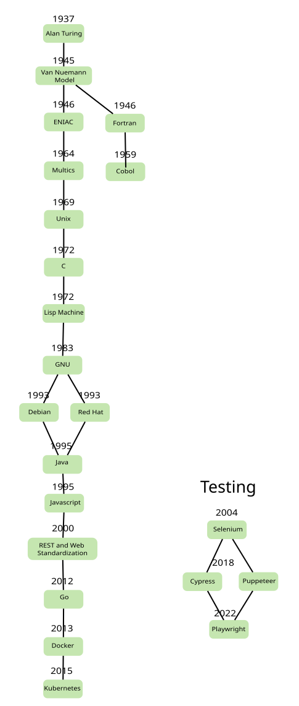

I am very interested in history of programming languages, Linux distros, and computing in general. I want some way to visually graph all my notes seen in my timeline. At first I read through the SVG docs on Mozilla, and soon realized hand coding SVGs is very tedious and inefficient. I later found Inkscape, a click-and-drag open source SVG editor. Here is what I have so far and progress can be seen on this [repo](https://github.com/Joe-Bulfer/history-timeline).  

So far there is a main timeline of the major events, such as early computing, languages, operating systems, and recent container technology. We will have separate timelines such as modern web quality assurance (QA)/testing frameworks. There will be a internet/web history either starting with ARPANET in 1969 or Tim Berners Lee and the world wide web of the 90s.

The plan is to click on a single event and a side panel will open to show an article. Similar functionality to this [website](https://roadmap.sh/frontend). There are multiple ways to do this, one, you could store each article as an HTML file on a server and every click of the SVG element would trigger an HTTP GET request and return that article, injecting/swapping whatever was in the side panel previously. Since by default only link and form tags can submit HTTP requests, you would use HTMX to give that ability to SVG rect elements. Also HTMX would gives hx-swap attribute to rects to swap the current content of the side panel with that which was just clicked. 

This hypermedia, client-to-server approach would be most scalable. However, until the project grows and it is necessary, I will be pushing a single SVG file to the limit by storing the articles as the rect's description attribute added with inkscape. A javascript event listener will be placed on every rect that will swap what is in the side panel all within the browser. As the single SVG grows, the loading speed may be effected and we can switch to a client-server architecture in the future.

### SVG Libraries

Using Inkscape makes creating SVGs much easier. What might be even easier is using an SVG framework like [Rapheal](https://github.com/DmitryBaranovskiy/raphael) or [Snap Repo](https://github.com/adobe-webplatform/Snap.svg). I am reading that Snap Repo is a newer version targeting modern browsers and was written by the same author as Rapheal. Here is a [star comparison](https://star-history.com/#DmitryBaranovskiy/raphael&adobe-webplatform/Snap.svg&Date) of the two repos. Also an [example](https://www.energy.gov/national-laboratories) of what is possible with these frameworks. It is a map. We want to build a timeline, but it doesn't matter, they are clickable, intractable SVG elements with tooltips.  

SVG libraries include Rapheal and Snap.svg. Snap was built by the same author of SVG but meant for modern web browsers. These are possibile frameworks though the current Inkscape approach works fine.

Example of rapheal
https://www.energy.gov/national-laboratories

Snap repo
https://github.com/adobe-webplatform/Snap.svg

### Personal Updates

UPDATE March 28th 2024: Ok looking back on this project, my Youtube channel, and website, I'm considering starting back up. I just got burned out cause I'm taking 18 credits in college plus an internship.

UPDATE Oct 19th 2024: No progress since last update. I don't know if this will go anywhere unless I start making youtube videos about history of technology [Asionometry](https://www.youtube.com/watch?v=z8L202FlmD4) style in which case I would make articles and videos with years associated with them, making a SVG timeline to embed into my website more useful and relavent.

