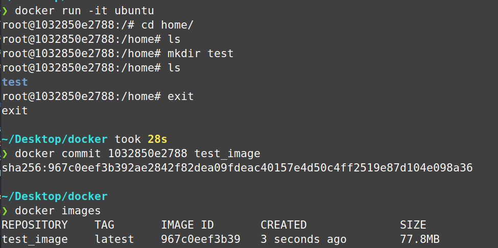
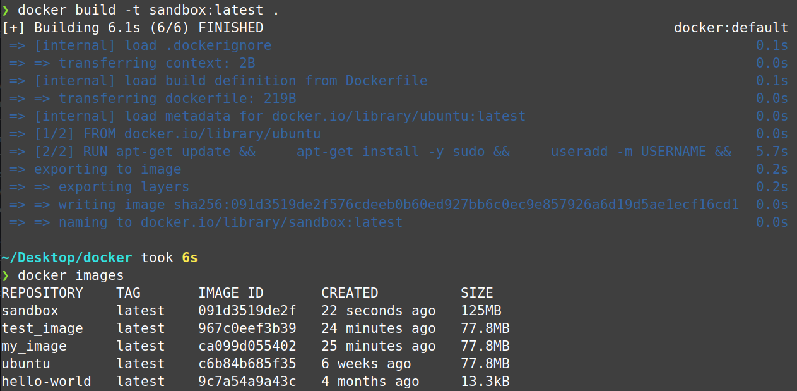
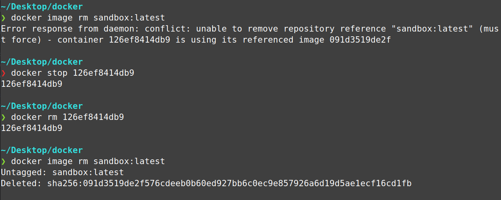

### Installation

The fastest and easiest way to get docker up and running on Linux is the  [Docker Install Script](https://github.com/docker/docker-install).This will install the latest stable version on supported Linux Distros. This includes the following:

- **docker-ce** - Community Edition Docker Engine
- **docker-ce-cli** - Docker Client/Command line Interface
- **docker-buildx-plugin**: Extends the Docker build with new features with a CLI plugin.
- **containerd.io**: A container runtime that manages the container’s lifecycle.
- **docker-compose-plugin** - orchestrates and manages Docker containers with compose files

Let's first fetch the script from the repo. 

```bash
curl -fsSL https://get.docker.com -o get-docker.sh
```

Now let's verify the script by looking through the code. You can cat into less or open it with your editor of choice

```bash
cat install-docker.sh | less
#OR
[YOUR-EDITOR] install-docker.sh`
```

For additional verification, we can dry run to display steps before actually running them

```bash
sh install-docker.sh --dry-run`
```

Now if we are confident it it secure and understand everything it is installing, let's run the script for real.

```bash
sudo sh install-docker.sh`
```

Now add yourself to the docker group. This will allow you to run docker commands with without prefixing everything with `sudo`. Reboot your system for this to take effect.

```bash
sudo usermod -aG docker ${USER}
```

That's it! Now you should have Docker installed and ready to go.

### Pull, Run and Basic Usage

There are two common ways to run containers. First, we can `pull` pre-built images from public registries like Docker Hub. Second, we can create our own dockerfile, `build` an image from it, and `run` it to create our own container.

First let's go with the first method. Before pulling this image, you can check it out on  [Docker Hub](https://hub.docker.com/_/hello-world) to get information about it. Optionally you can run  `docker search hello-world` from the command line.

You can either `pull` and then `run`, or you can just run. Docker will first check for the image locally, and if it does not find it (in this case, if you didn't pull it), it will automatically pull it for you off of Dockerhub.

```bash
docker pull hello-world
#OR
docker run hello-world
```

This hello-world image is really just to make sure your installation works correctly, and in this case, to familiarize yourself with the basic commands.

To run a real container, you can pull the official Ubuntu image and run it, or again, just run it and have docker find and pull it for you.

```bash
docker run -it ubuntu bash
```

The `-i` flag is for interactive, which keeps the standard input open, allowing you to interact with the container like you would expect, and `-t` is for tty, which allocates a psuedo tty/terminal inside the container. This simulates a real terminal like when you SSH into a remote server. After we specify our image, in this case Ubuntu, we run a bash shell. Although for the official Ubuntu image, this is probably unnecessary and already configured as a command in the cmd attribute.

After running the above command you should now be inside a real docker container. Play around with it, install whatever you want. If you have some balls, run `sudo rm -rf /` and see what happens. When you're done dinking around, you can `exit` the container. 

Changes to the container will not be saved until you `commit` them. Let's say you make a test directory with `mkdir test`, then `exit` the container.  When commiting, you enter the container_id followed by the name of the image. The container_id can be found after the user "root", I've copied and pasted it here. Every commit creates a new image as if it were a snapshot in time. You can see my test_image worked after listing the images with `docker images`.



Ok cool, so we can play around with a prebuilt image. My problem is, this Ubuntu image always logs me in as root. I don't like that. I want to be logged in as a regular user but have the option to act as root with `sudo`, like the normal Linux experience. This is ideal for a development environment, which is what I am interested in, and maybe you are too. Either way it will be useful for you to know how to create your own images from docker files.

### Making Containers with Dockerfiles

Making docker files is simple, just create one with your text editor (I use neovim btw). Just make sure to name it exactly "Dockerfile" with a capital D. This is what docker expects when you `build` the image from it.

`nvim Dockerfile`

Add this to your file. Replace USERNAME with whatever name you want and 1234 to your own password.

```
FROM ubuntu
RUN apt-get update && \
    apt-get install -y sudo && \
    useradd -m USERNAME && \
    echo "USERNAME:1234" | chpasswd && \
    adduser USERNAME sudo

USER USERNAME
```

Basically all we are doing, is creating an Ubuntu image with your own username and password. This way it will be similar to a regular Linux experience, with regular root privileges using `sudo` which prompts for your password.   

Now build an image from the file. You do not have to specify the file, Docker fill find it. the `-t` stands for tag, this allows you to name your container with an optional tag name prefixed with a semicolon. Make sure you include the dot at the end for location.

```bash
docker build -t container_name:tag_name . 
```

Now make sure it was created by listing images with `docker images`. 



Ok, now you should be good to good to go. Spin up the c


NOTES ARE STILL IN DEVELOPMENT

### Manage Docker Engine

Let's learn how the docker engine works. It is managed as a `systemd` service and is thus managed with the  `systemctl` (system control) command. Let's verify it's active.
```bash
sudo systemctl is-active docker
```

### Removing Images and Containers

When trying to remove a image, you will often get an error because an active container is running off the image. To fix this, simply `stop` and `rm` that container referencing it's id. This will permanently delete the container and image, so make sure you know what you are doing.




### Additional

To check the command attribute of an image, enter the following. This is useful to know to check if you need to specify the shell when spinning up a container.

`docker image inspect [image] --format '{{.Config.Cmd}}'`

This should usually return `[/bin/bash]`. If it doesn't, you may have to add `bash` to this command: 
`docker run -it [image] bash`

