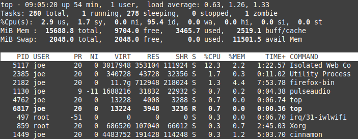
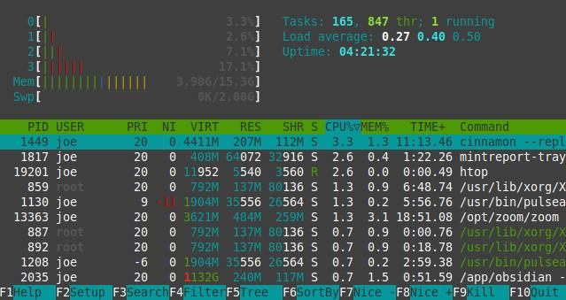

### Overview

Let's say your new to Linux, transitioning from the Windows Task Manager to Ubuntu's System Moniter. This is a relatively easy transition, however, further down your Linux journey you will delve further into the terminal and find alternatives to GUI applications. This alternative is a program called `top`. Written in 1984, it is tried and tested against time, and will continue to be the default resource monitor in the near future. Despite other programs, such as `htop`, `vtop`, `powertop`, etc., doing essentially the same thing, I would recommend not to over analyze and simply learn the default. `top` works perfectly fine as an alternative to the System Monitor for an everyday Linux user and can even help down the line with Linux Administration if that's what you are interested in.

### Statistics and Process Table

After running the `top` command, you will get something like this. In two main parts, the statistics are at the top, and the process table at the bottom. At the very top, starting from the left, you can see the up time, which is how long the system has been running. Moving right, the number of users is displayed, then we have load average, which is average CPU usage in the past 1 minute, 5 minutes, and 15 minutes. It is  based on your number of cores. For example if you have 4 cores, then a 4.0 would mean 100% CPU usage, in this screenshot, I have 2 cores so in the past 1 minute I had 63% usage of my 2 cores.



Below the number of tasks running, you will see the percent of CPU utilization from user processes, the kernel, and processes with a positive niceness value (often manually configured). Next the `id` is the percent of time idle (if high, CPU may be overworked). Lastly `wa` is the percent of wait time (if high, CPU is waiting for I/O access).

```
%Cpu(s):  1.7 us,  0.6 sy,  0.1 ni
```

`id`, `wa`, and `st` help identify whether the system is overworked. Here is a total 
Now, let's go over each column in the process table.

- **PID**: Process ID.
- **USER**: The user running the process.
- **PR**: Priority of the task computed by the kernel on a scale of 20 to -20.
- **NI**: "Niceness" value, which involves the priority of user processes. 0 is the default and highest priority.
- **VIRT**: Virtual and physical memory, representing the total memory space allocated to a process, including RAM and swap. It's like a hypothetical maximum needed by the program. RES + Swap space = VIRT
- **RES**: Resident (Physical) memory used by the process. VIRT - Swap space = RES
- **SHR**: Shared memory.
- **S**: State of the process, where "R" means running, "S" means sleeping, and "I" is idle.

### htop

The most popular alternative, `htop`, provides more customization, scrolling and mouse support, color, and an overall cleaner interface. Unlike `top`, it does not come preinstalled but is worth checking out with a quick download.

```
sudo apt install htop
```

I recommend to learn `top` first and then try out `htop`, comparing the two. 

Upon running `htop`, you will first realize the displayed columns discussed above are exactly the same, as well as the tasks, load average, and up time at the top right. The main difference is the colorful, more readable TUI (text user interface) that supports mouse events and scrolling. An example of this is the CPU column, colored blue after clicking, ordering the processes by CPU consumption. 



### Additional

- Mental Outlaw, a popular Linux youtuber, has reviewed `htop` and like me, recommends still learning `top` as it comes preinstalled on many Linux distros by default. At 1:08-1:55 of this [video](https://youtu.be/I6T7nSO-WNg?t=68) he compares the two.
- Great video by [Learn Linux TV](https://www.youtube.com/watch?v=4bJmzHh4pg0) going more into load average.


