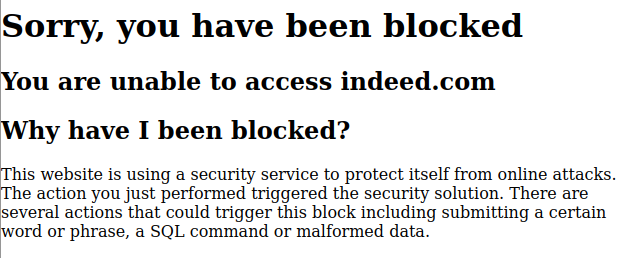

When using the requests library alone, it will often trigger a security feature to prevent online attacks. Here I'm wanting to do some scraping on Indeed for job listings and I suspect I will need a user agent to get past this.
```python
import requests
r = requests.get("https://www.indeed.com/jobs")
print(r.text)
```
Here is the HTML page response. Cloudflare has blocked me.



Though I could try to use a fake user agent to fool Cloudflare, their security features are too advanced. Instead [Undetectable Chromedriver](https://github.com/ultrafunkamsterdam/undetected-chromedriver) should do the trick.
