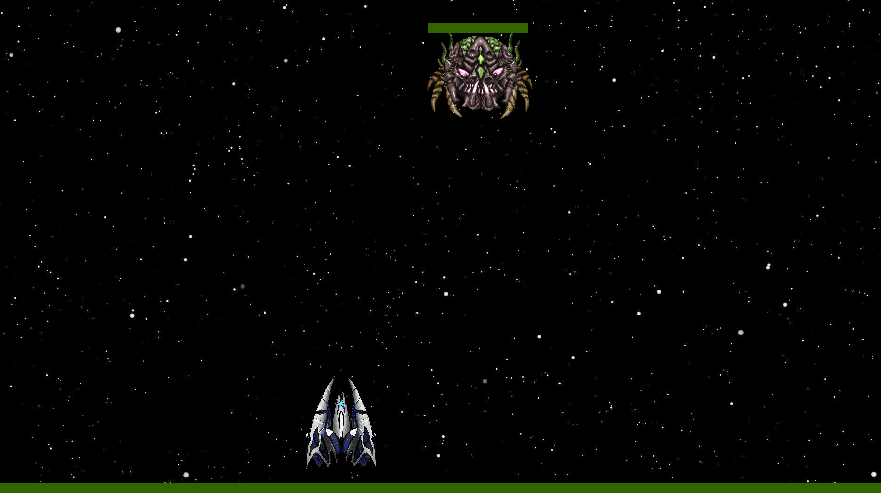
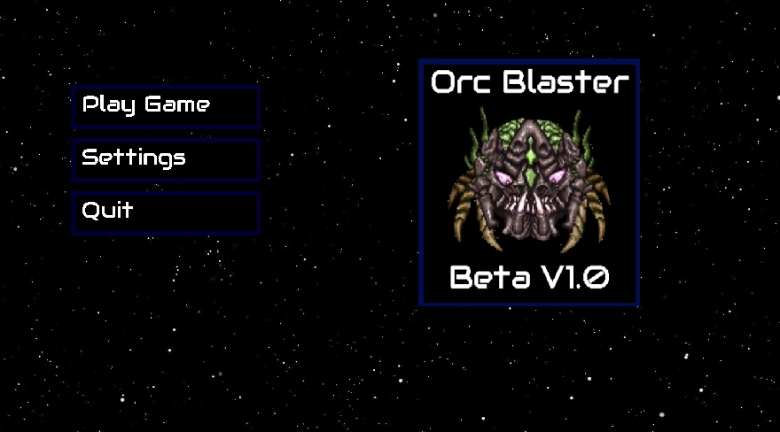
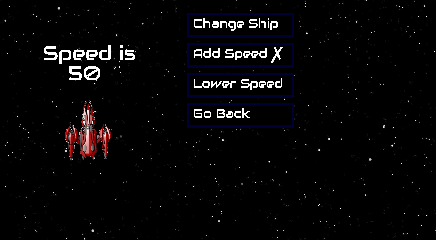

### How I Started

After learning basic programming logic (for loops, functions etc.) and Python syntax, I wanted to build something big, not just a small terminal program that asks for your name, or age, and does some simple function. [Pygame](https://github.com/pygame/pygame) was the perfect library. This would allow me build a larger program, learn debugging, and implement an object oriented design with the players and enemies to to learn OOP (Object Oriented Programming).

### Overview

Whether you are on Windows or Linux, you should be able to install Pygame with Python's package manager `pip` , and use your editor of choice. I will be using Vim from my Linux Terminal. Source code for the entire game will be in this [repo](https://github.com/Joe-Bulfer/Orc-Blaster-V2).

This will not be a conventional programming tutorial where we go line by line. Instead it will be about adding and removing chunks of code at a time, so you can get a bigger picture of what is going on. This way you will not simply copy the code from the tutorial (like most are), but understand what a fully functioning program looks like that you can play around with and break. 

### Boilerplate

Here is a basic boilerplate of any Pygame program. To avoid future confusion as you read other tutorials, I have given a few different options, including the main game loop being a never ending loop, only stopped by the `exit` method, as well as creating a `running` variable set to True, and set that to False when we want to quit. The other option is the `display` or `update` method, which I argue my case for the `display` method below.

Pygame's `init` and `quit` methods are opposites, initializing and deinitializing the Pygame library. `display.set_mode` creates the window, taking the width and height as arguments. `for event in pygame.event.get():` will loop through each Pygame event, such as click events, keyboard input, or quitting the game. 

As for the end, the `update` method is really only for updating certain rectangular part of the display surface for optimizing performance, since it will default to updating the entire screen, it is functionally the same as the `flip` method. You will often see the update method in tutorials, I think this is wrong and the `flip` method is preferable until you actually need to optimize your game, in which case you should use `update`

```python
import pygame 
from sys import exit

pygame.init() # turn on pygame

win = pygame.display.set_mode((800,500)) # 800 pixels wide, 500 pixels tall

#running = True

#while running
#OR
while True:
    for event in pygame.event.get():
        if event.type == pygame.QUIT: 
            pygame.quit() # turn off pygame
            exit() # using the sys library, exit the entire python program
		#OR
		# running = False

    pygame.display.flip()
    #OR
    #pygame.display.update()
```

### Pictures of Final Game

You can dig through the repository for the finished project [here](https://github.com/Joe-Bulfer/Orc-Blaster-V2). (Several months later) I don't imagine I will ever get around to finishing a tutorial for this. It's only 340 lines of Python that is well commnented so you can probably make things out on your own.




