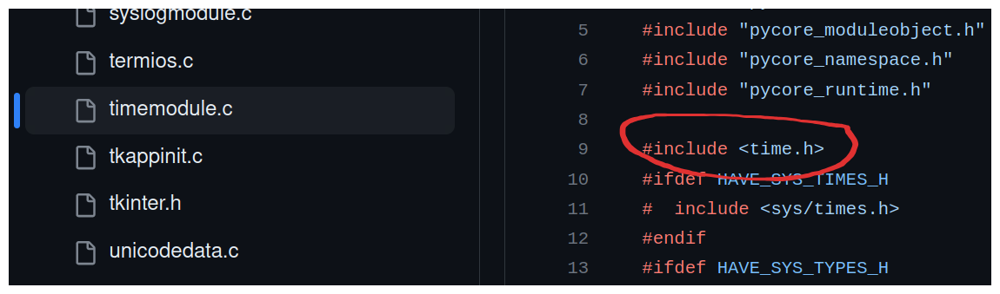

It is known that Python's implementation, CPython, which act's as both an interpreter and a compiler, is written in C. Similarly, the Python Standard Library, including all of the most popular modules such as time, random, and os are also written in C. To have a better appreciation of Python and how it works under the hood, it is worth digging through some of the Python's [source code](https://github.com/python/cpython#general-information) to gain a greater understanding.

First let's consider a simple program in Python that imports the time module and prints out the time. 

```python
import time

seconds = time.time() # seconds since Epoch/Unix time (Jan 1st 1970)

time_h = time.ctime(seconds) # human readable time
print(time_h) # Thu Sep 28 18:54:21 2023
```

This seems to work just like magic, and it is! But really it is an abstraction, a wrapper around C's `<time.h>` library. Let's consider the same program in C. First we include two header files,  one for standard input output (stdio), and the other for time, then we do the same thing as the python file. 

```c
#include <stdio.h>
#include <time.h>

int main() {
    time_t current_time;

    seconds = time(NULL); // seconds since epoch

    printf("%s", ctime(&current_time)); // human readable time
    // # Thu Sep 28 18:54:21 2023

    return 0;
}
```

That works just as easily, but there are times when writing C code can get very verbose and tedious, as it is a lower level language that provides more granular control over hardware and memory management, which often requires more explicit code. Python make's things easier and provides abstractions for C's [standard libraries](https://en.wikipedia.org/wiki/C_standard_library) such as `<time.h>`, and `<math.h>`.

The time module in python and it's methods are defined in [timemodule.c](https://github.com/python/cpython/blob/main/Modules/timemodule.c) under Modules in the CPython repository. Here is the `ctime` function we used earlier in the Python file that prints out the human readable date. 

```c
static PyObject *
_asctime(struct tm *timeptr)
{
    static const char wday_name[7][4] = {
        "Sun", "Mon", "Tue", "Wed", "Thu", "Fri", "Sat"
    };
    static const char mon_name[12][4] = {
        "Jan", "Feb", "Mar", "Apr", "May", "Jun",
        "Jul", "Aug", "Sep", "Oct", "Nov", "Dec"
    };
    return PyUnicode_FromFormat(
        "%s %s%3d %.2d:%.2d:%.2d %d",
        wday_name[timeptr->tm_wday],
        mon_name[timeptr->tm_mon],
        timeptr->tm_mday, timeptr->tm_hour,
        timeptr->tm_min, timeptr->tm_sec,
        1900 + timeptr->tm_year);
}
```

If you you look at the beginning of this same file, you will see the `<time.h>` library.



As you can see, the Python Time module, and many others, are in fact built directly in C. For example, when you write a Python program managing sockets that enable communication over a network, the sockets module is in fact build directly from C's `<sockets.h>` library. The same goes for every other module in the standard library, such as random, abc, math, and so on. 


