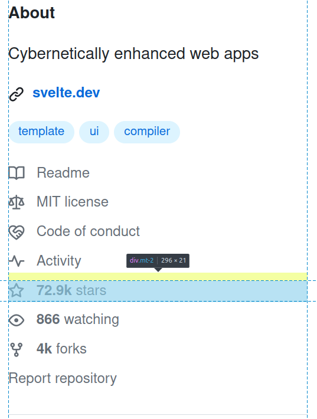
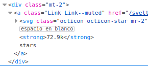
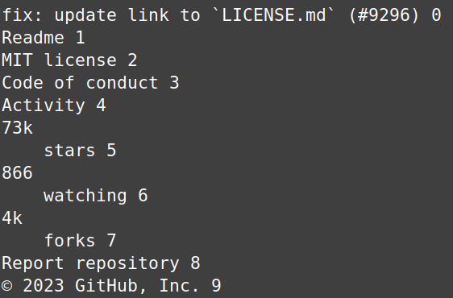
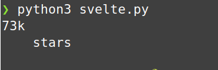
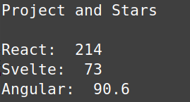

The first package necessary for webscraping in Python is [requests](https://requests.readthedocs.io/en/latest/). At 331 million downloads per month, it is one of the most [popular](https://pypistats.org/top) downloads on the Python Package Index (PyPI). It is a simple and easy HTTP library, which in our case, will be used to `get` a url and store that in a response object, to then print out the text (HTML) content. Pretty print gives us a formatted and readable output.

```python
import requests
from pprint import pprint

r = requests.get('https://github.com/sveltejs/svelte')
print(type(r))
pprint(r.text)
```

As you can tell by the url I am requesting, I am interested in [Svelte.js](https://svelte.dev/), a very popular, lightweight Javascript framework for building web apps. I want to track the growth of this project, and compare it against other frameworks like React and Angular. The easiest metric would be the stars on their github repositories. I recommend you take a look at the [repo](https://github.com/sveltejs/svelte), and open up dev tools with  with `ctrl` + `alt` + `c` and inspect this element so you understand what we are about to do.



If you look at the HTML of that particular `div` element that contains the stars, there is no `id` to easily grab. Most element either have an `id` attribute, which is unique, or a `class` attribute, which is shared across elements. Since there is only a class of `mt-2` as of making this video, it will be a bit tricky as it is hard to distinguish that specific element while scraping. If there were an id of say, `star-content`, it would look something like this:

```python
import requests, re
from bs4 import BeautifulSoup as bs4

r = requests.get('https://github.com/sveltejs/svelte')
soup = bs4(r.text,'html.parser')

stars = soup.find('div',id="star-content")
print(stars.text)
```

As you can tell from above, we will need the [bs4](https://pypi.org/project/beautifulsoup4/) package. We would request the url the same as before, then wrap it in a `Beautiful Soup` object using either `html.parser` or `lxml`. Next, find a div element with an id of "star content", then print out just the text inside the html tags. Since we don't actually have an id in the element, we will instead have to identify it with the class of `mt-2`. Since their are many elements with this class, we will have to use the `find_all` method and find out which on it is.



Let's find all div elements with class of `mt-2`. This will store them in an array, each element being indexed.  
```python
mt_el = soup.find_all('div',class_="mt-2")
print(mt_el)
```

But how do we tell which one is the element with the star data? After all, that's all we want. The best way is to print out each element, with it's corresponding index. There is a lot of white space, so we will use python's build in `strip` method.

```python
for i,el in enumerate(mt_el):
    print(el.text.strip(),i)
```

You should get an output like this:



If you look at the screenshot from earlier, you can tell this output is exactly the text content of every element in the about section. Since we know the stars are on the 5th index, we can go back and grab just that content.

```python
mt_el = soup.find_all('div',class_="mt-2")
stars = mt_el[5].text.strip()
print(stars)
```

This will output something like this:



To grab just the `73`, we will use a regex (regular expression) with the [re](https://docs.python.org/3/library/re.html) module. 

```python
mt_el = soup.find_all('div',class_="mt-2")
star_el = mt_el[5].text.strip()
match = re.search(r'(\d{1,4}\.\d+|\d{1,4})', star_el)
stars = match.group()
print(stars())
```

This should print just `73`. 

So we can find the stars on the Svelte repo, great. But if you test this on other repos, the index of the star element will differ slightly, making it difficult to wrap in a function, for example, if I wanted to find the stars for the React repo, it is not on the 5th index, but rather the 6th.

```python
mt_el = soup.find_all('div',class_="mt-2")
star_el = mt_el[6].text.strip()
match = re.search(r'(\d{1,4}\.\d+|\d{1,4})', star_el)
stars = match.group()
print(stars)
```

To have a function that takes a url as an argument and automatically finds the index with the stars, we will have to create a temporary list that contains the stripped out text content of each div, to then be be searched for "stars" and the regex applied. Here is the program so far.

```python
import requests, re
from bs4 import BeautifulSoup as bs

def get_stars(url):
    r = requests.get(url)
    soup = bs(r.text,'html.parser')

    mt_el = soup.find_all('div',class_="mt-2")
    tmp_list = []
    for i, e in enumerate(mt_el):
        tmp_list.append(mt_el[i].text.strip())

    for e in tmp_list:
        if "stars" in e:
           match = re.search(r'(\d{1,4}\.\d+|\d{1,4})',e)
           star = match.group() 

    return star

svelte = get_stars("https://github.com/sveltejs/svelte")
react = get_stars("https://github.com/facebook/react")
angular = get_stars("https://github.com/angular/angular")

print("Project and Stars\n")
print("React: ",react)
print("Svelte: ",svelte)
print("Angular: ",angular)
```

Expected output:



That's pretty cool. But is it really that useful? I mean I can just go and open up the url and look myself, after all. What would really be useful is to track the growth, maybe run the script everyday at a scheduled time, then append that to a json file. So we will need the date, then key value pairs that correspond to the project and stars. I am imagining a nested dictionary like this:

```python
data = {
    "10-04-2023": {
        "React": 214,
        "Angular": 90.6,
        "Svelte": 73,
    }
    "10-05-2023": {
        "React": 218,
        "Angular": 90.9,
        "Svelte": 74,
    }
    "10-06-2023": {
        "React": 221,
        "Angular": 91.2,
        "Svelte": 86,
    }
}
```

This will be super useful, because dictionaries in python are equivelent to json (javascript object notion) which are just key value pairs as well. This way, we could use a javascript charting library to visually represent the data using [chart.js](https://www.chartjs.org/).

Alright, so to do that, we first need to get the date using the datetime module. Then to make things easier, I've made a `urls` dictionary with the name as a key, and url as a value. This way, we can easily add as many projects we want to track by simply adding them to this dictionary. The `data` dictionary is where the valuable data is stored, we will then open a json file to append and `dump` that data using the json library.

```python
from datetime import datetime
import requests, re, json
from bs4 import BeautifulSoup as bs

today = datetime.now().strftime('%m-%d-%Y')
urls = {
    'Svelte': 'https://github.com/sveltejs/svelte',
    'React': 'https://github.com/facebook/react',
    'Angular': 'https://github.com/angular/angular'
}


def get_stars(url):
    r = requests.get(url)
    soup = bs(r.text,'html.parser')

    mt_el = soup.find_all('div',class_="mt-2")
    #star_el = mt_el[6].text.strip()
    tmp_list = []
    for i, e in enumerate(mt_el):
        tmp_list.append(mt_el[i].text.strip())

    for e in tmp_list:
        if "stars" in e:
           match = re.search(r'(\d{1,4}\.\d+|\d{1,4})',e)
           star = match.group() 

    return star

data = {}
data[today] = {}
for name, url in urls.items():
    stars = get_stars(url)
    data[today][name] = float(stars) if '.' in stars else int(stars)

with open("data.json", "a") as f:
    json.dump(data, f, indent=4)
```

Now if you want to schedule this to automatically run everyday, you could use [windows scheduler](https://datatofish.com/python-script-windows-scheduler/) or [cron](https://towardsdatascience.com/how-to-schedule-python-scripts-with-cron-the-only-guide-youll-ever-need-deea2df63b4e) if you're on Linux or Mac.

If you'd like, I can make a tutorial on displaying this data using chart.js. Otherwise, if you're really curious of this kind of data, you should know a tool like this already exists. To track the star history of a github repository, you can use [Star History](https://github.com/star-history/star-history )which is an open source project that uses Github's official API to find metadata of each project, including stars. This is a much more reliable method than ours, as our script would break the day Github updates their user interface, which is a common obstacle in webscraping.

To compare Svelte, React, and Angular, you can view using their website [here](https://star-history.com/#sveltejs/svelte&facebook/react&angular/angular&Date)

Regardless, web scraping is a valuable skill to have, and Python libraries makes it very easy and intuitive. 


