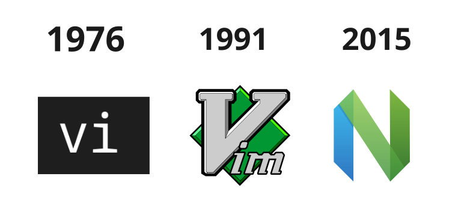
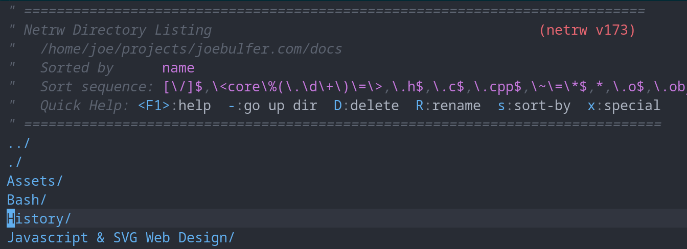
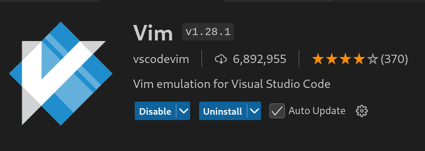

> 📝️ **Video Transcript**: This is the transcript for a video on my youtube channel. It should still be just as readable as an article, but you can also see the video [ Why and How to Learn Vim/Neovim](https://www.youtube.com/watch?v=sC59dga1VdM).

### History

Vim is a terminal-based text editor that dates back to it' predecessor, Vi, first released in 1976. At this time, during Unix and early days of MSDos, text based interfaces were predominant, So Vi's development was influenced by the environment of that era, where interacting with computers was done mostly with keyboards rather than mice. It wasn't until the 1980s with the rise of Graphical User Interfaces where Mice become popularized. Despite this, Vim, which stands for Vi improved, and's it's successor Neovim,  remain popular, with people choosing to ditch mice  for full control from their keyboard. 

*Vi dates back nearly 50 years, with Neovim (2015) as it's most recent successor.*

### Why Vim is So Popular

It's popularity is likely due to two reasons. The first being a practical reason, that, when surpassing the inevitable learning curve, you eventually become more productive at navigating through files and directories, editing text files, creating macros to automate tasks, and so on. Besides the utility, the configuration of Vim and Neovim appeals to a particular audience, those who enjoy modifying and sharing their Vim and Bash RCs, or configuration files with others. There's a certain itch for people that's scratched when they have full granular control over applications, this is what some people call a PDE, or Personalized Development Environment, as opposed to a regular IDE, or Integrated Developer Environment, such as PyCharm and VScode. 

I happen to fall in into the former utility based group, so although I can't show you fancy ways to customize or install any additional plugins, what I can demonstrate is straightforward examples of Vim being more efficient than the typical clicking and copy/paste with your mouse.

### Netrw

Firstly we have that weird screen that opens up when you accidentally run vim on a directory instead of a file. That is netrw, or network read and write. As the name suggests, it was originally intended for reading and writing files over a network, but most use it for local browsing to have have your own file explorer all within Vim. Lately I much prefer it over the traditional GNU CoreUtils, instead of moving or renaming a file with mv,  sorting with various ls flags, or typing a command longer than I'd like, in netrw, I'm one key away. Toggling with with i until we reach the tree view, allows me to toggle what's inside each directory. If I find a file I want to inspect, I'll hit v to open a visual split, when done, I could either ZZ, or :wq to save and quit or CTRL + w + q for window quit.

| GNU CoreUtils    | Netrw   | Description                      |
| ---------------- | ------- | -------------------------------- |
| mkdir            | d       | Make directory                   |
| touch            | %       | Create empty file                |
| rm or rmdir      | D       | Remove file or directory         |
| mv [file or dir] | R       | Move or rename file or directory |
| ls -S, -t        | s       | Sort by size, time, etc.         |
| cd [dir]         | [Enter] | Move into directory              |
| cd ..            | -       | move up a directory              |

*Inside Netrw*

See full [video](https://www.youtube.com/watch?v=sC59dga1VdM) for more Vim hotkeys and shortcuts.

So although all of these are a lot to memorize, with actual practice, muscle memory quickly takes over, and quickly managing files and directories, and editing files, becomes effortless from the keyboard. Your hands will remain more stationary and your eyes fixed on the screen, moving them less often to find your mouse, in a brief, periodic, and distracting instant.

### Vim in VSCode

Unfortunately, when working collaboratively at your job, you will likely be the odd one out using Vim instead of VSCode. Many jobs even require you to use a certain IDE with their list of extensions. Luckily in my case, VScode has a Vim emulator that behaves just as you'd expect. The only downside is the occasional conflict of hotkeys. 

*Vim Emulator Extension in VScode*

So overall, given Vim's long history as an effective editor, it will likely stick around for many more years in the future, and therefore worth investing your time in learning. For nearly 50 years, the same insert, normal, command mode and basic motions have stuck around, and are now portable across IDEs in the form of extensions and plugins. Even my note taking app, Obsidian, has a optional Vim mode built in. 

So even if you don't want to install and configure vim or neovim, chances are, an application you're using now, supports basic motions and keybinding, which is a great way to practice, 

If you liked this video, consider subscribing, liking or commenting to support the channel and more content like this. Thanks for watching.
